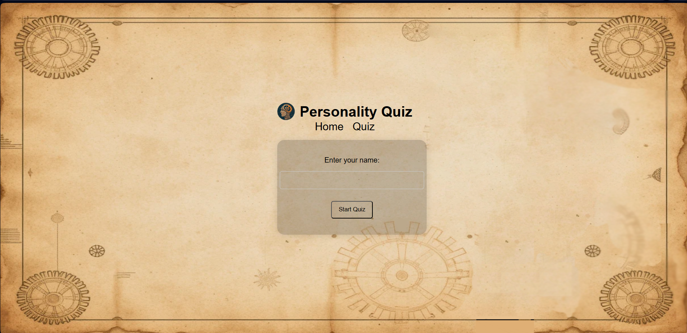

<h2 align="center">
  <a href="" target="_blank">Personality Quiz</a>
</h2>

  

 

## Getting Started

Clone down this repository. You will need `node.js` and `git` installed globally on your machine.

## 🛠 Installation and Setup Instructions

1. Installation: `npm install`

2. In the project directory, you can run: `npx vite --port=4000`

Runs the app in the development mode.\
Open [http://localhost:4000](http://localhost:4000) to view it in the browser.
The page will reload if you make edits.
